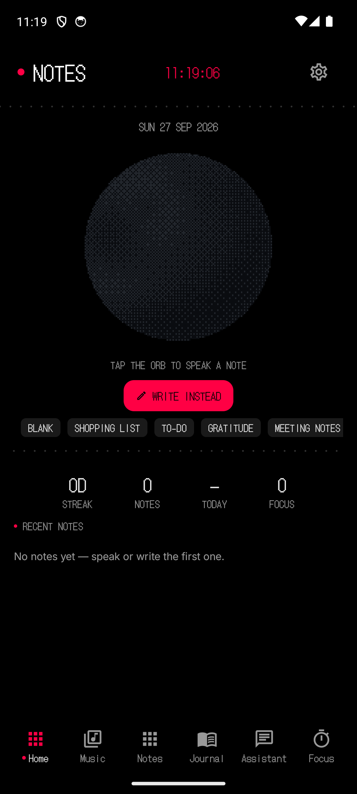
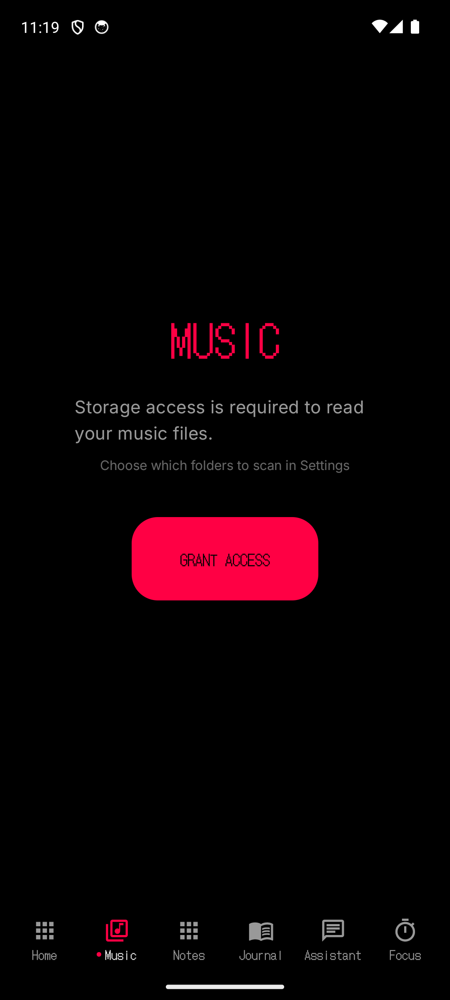
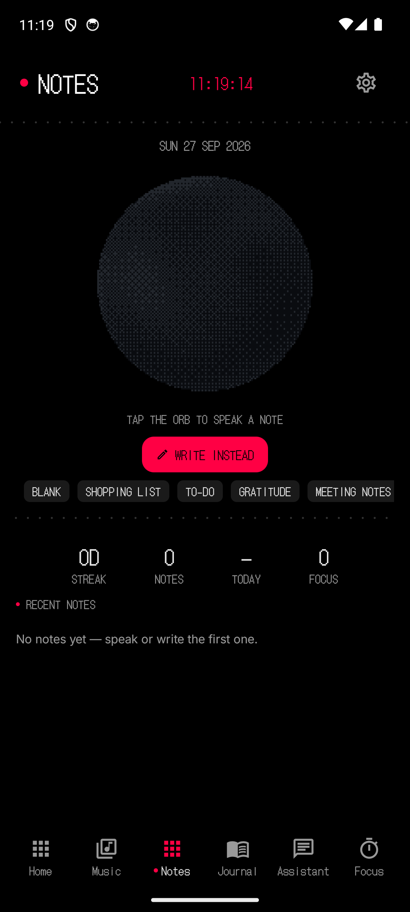
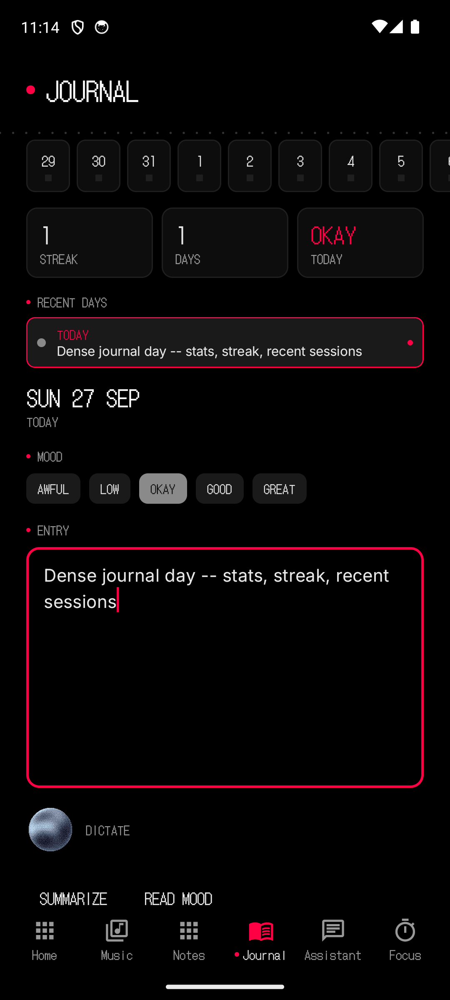
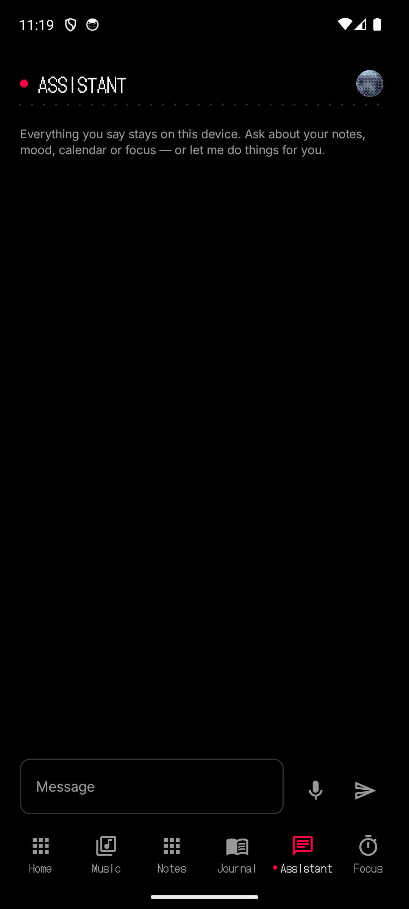
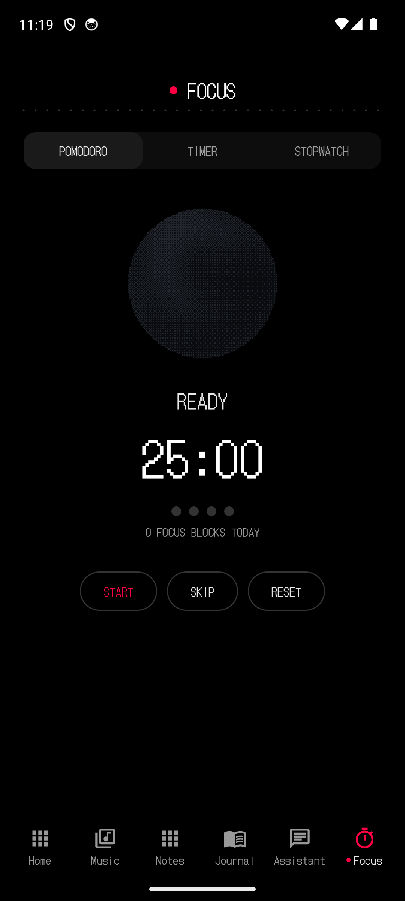
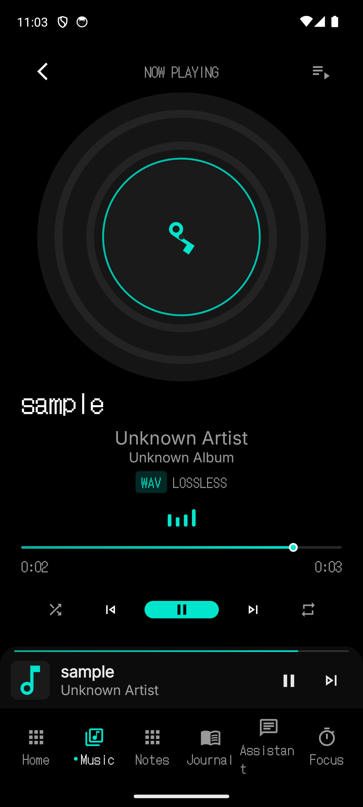
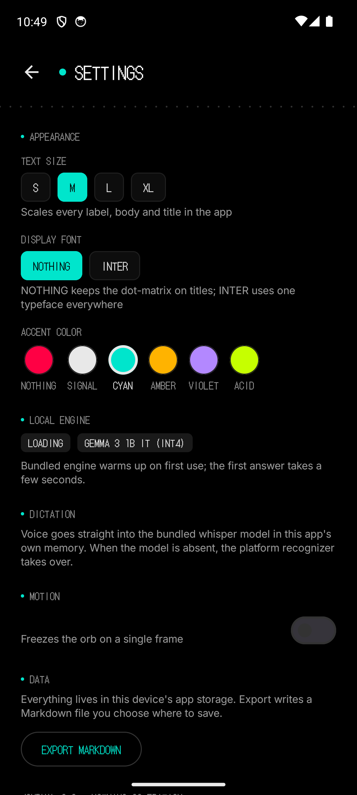

# Nothing One

**One app. Everything local. Nothing watching.**

[](https://github.com/NavatejR/Nothing-One/actions/workflows/ci.yml)
[](https://github.com/NavatejR/Nothing-One/releases)
[](LICENSE)


Nothing One unifies a music player, notes, journaling, an offline AI assistant, a calendar and a pomodoro focus timer into a single Android app in the exact visual language of NothingOS — pure black, dot-matrix type, one red accent.

> `0.0.0.0` — it never talks to anyone.

```text
┌─────────────────────────────────────────────┐
│  · NOTHING ONE                              │
│  ─────────────────────────────────────────  │
│  NO INTERNET PERMISSION                     │
│  NO ANALYTICS · NO ACCOUNTS · NO CLOUD      │
│  ALL DATA STAYS ON THIS DEVICE              │
└─────────────────────────────────────────────┘
```

---

## Privacy by architecture, not by policy

The strongest privacy guarantee is one that cannot be revoked. Nothing One's manifest does **not** declare `android.permission.INTERNET`. There is no code path — obfuscated or otherwise — by which your data, your voice or your usage can leave the device.

| | |
|---|---|
| **Network access** | Impossible — no INTERNET permission in the manifest |
| **AI inference** | Gemma 3 1B (int4) runs fully on-device via Google AI Edge |
| **Speech-to-text** | whisper.cpp `tiny.en` compiled natively into the APK |
| **Calendar** | The device's own `CalendarContract` provider — no Google API, no account |
| **Analytics / telemetry** | None. There is nothing to send and nowhere to send it |
| **Storage** | Room database in app-private storage; device backups exclude nothing you didn't write |

Permissions declared: `RECORD_AUDIO` (dictation), `READ_CALENDAR` / `WRITE_CALENDAR` (device provider), `READ_EXTERNAL_STORAGE` (≤ Android 12, local music), `FOREGROUND_SERVICE_MEDIA_PLAYBACK`, `WAKE_LOCK`, `POST_NOTIFICATIONS`, `MODIFY_AUDIO_SETTINGS`. Nothing else.

## What's inside

- **Home** — a dashboard that reads like a watch face: live clock, journaling streak, today's mood, completed focus blocks, next event from your calendar, and the red orb waiting to take dictation.
- **Music** — full local-library player: folder scanning, albums, playlists, queue, lyrics (LRC), equalizer, sleep timer, persistent playback via a Media3 foreground service.
- **Notes & Journal** — markdown editor with templates, tags, pinning, mood check-ins, and searchable history.
- **Assistant** — a chat with a 1B model that knows your context. Before every reply it reads your recent mood, note titles, next event and focus stats — and shows you exactly what it read. It can propose actions (create a note, add an event, start a focus session) that you confirm with one tap before anything is written.
- **Focus** — pomodoro (25/5/15 cycles), countdown timer and stopwatch. Completed focus blocks are logged locally and surface on the dashboard and in the assistant's context.
- **Calendar** — month grid and agenda over the device calendar provider, including an app-owned local calendar ("Nothing One") that the assistant and calendar screen can write to without any account.

## Screenshots

| Home | Music | Notes |
|---|---|---|
|  |  |  |
| **Journal** | **Assistant** | **Focus** |
|  |  |  |
| **Now Playing** | **Appearance** | |
|  |  | |

## The orb

A GL shader (the shdr-14 field) rendered through a `TextureView` + EGL pipeline breathes behind everything, mirroring the assistant's state: **idle · listening · thinking · speaking · sleeping**. It also reacts live to your microphone level while dictating.

## Architecture

```text
app/src/main/java/com/nothing/one/
├── MainActivity.kt          Unified shell: 6-tab bottom bar + mini player
├── ChatViewModel.kt         Assistant brain: memory → prompt → tools
├── ai/                      LocalAiClient (Gemma), WhisperJni, AssistantMemory, AssistantTools
├── speech/                  SpeechRecognizerManager + whisper dictation pipeline
├── data/                    EntryRepository, SettingsRepository, Room DB (entries · focus · chat)
├── feature/
│   ├── music/               52-file port: player, library, lyrics, equalizer, service
│   ├── focus/               PomodoroEngine (pure), FocusViewModel, FocusTrigger
│   └── calendar/            CalendarRepository (device provider), CalendarViewModel
├── ui/
│   ├── orb/                 OrbEngine / OrbRenderer (shdr-14), ShaderOrb composable
│   ├── components/          DotMatrixText, RedDot, DotGridDivider, DotMatrixBadge…
│   ├── markdown/            Local markdown renderer
│   └── screen/              home · chat · journal · editor · insights · settings
└── cpp/                     Vendored whisper.cpp v1.9.4 + JNI bridge (libnothingone_whisper.so)
```

**Stack:** Kotlin 2.0 · Jetpack Compose (BOM 2024.09) · Hilt 2.51 · Room 2.6 · Media3 1.3 · MediaPipe tasks-genai 0.10 · whisper.cpp v1.9.4 (NDK r27, CMake 3.22.1) · minSdk 26 / targetSdk 34.

## Building from source

Requirements: JDK 17, Android SDK 34, NDK r27 (`27.0.12077973`), CMake 3.22.1.

```bash
git clone https://github.com/<you>/Nothing-One.git
cd Nothing-One
./gradlew assembleDebug
adb install app/build/outputs/apk/debug/app-debug.apk
```

### Installing a release

Prebuilt APKs are attached to each [GitHub Release](https://github.com/NavatejR/Nothing-One/releases). CI-built APKs exclude the AI models (see below); release APKs built locally with `./scripts/fetch-models.sh` already applied include them. On first launch Android will ask to allow installing from this source — no other setup is required.

### Models (required for the assistant)

The AI weights are not committed — they add ~600 MB. Either copy them from a local checkout or fetch them:

```bash
./scripts/fetch-models.sh
```

| Model | File | Size | Role |
|---|---|---|---|
| Gemma 3 1B IT (int4) | `app/src/main/assets/ai/gemma3-1b-it-int4.task` | ~529 MB | Assistant replies & tool calls |
| Whisper tiny.en | `app/src/main/assets/ai/ggml-tiny.en.bin` | ~74 MB | On-device dictation |

Both load lazily; the app runs fine without them (music, notes, journal, calendar and focus all work — the assistant reports `LOCAL ENGINE OFF`).

### Tests

```bash
./gradlew testDebugUnitTest
```

The pure-logic core is fully unit-tested: the pomodoro state machine, the assistant's tool-JSON parser, calendar month-window boundaries and streak arithmetic.

### Release signing

Copy `keystore.properties.example` to `keystore.properties` and fill in your values. Without the file, release builds fall back to the debug key so `./gradlew assembleRelease` still produces an installable APK.

## Design system

| Token | Value |
|---|---|
| Background | `#000000` |
| Surface | `#0D0D0D` |
| Elevated | `#1A1A1A` |
| Accent | `#FF0044` (Nothing Red — the only color in the app) |
| Display type | DotGothic16 (dot-matrix) |
| Body type | Inter Variable |

Signatures: a red dot prefixes every active label, dot-grid lines divide sections, all-caps dot-matrix labels mark states (`LISTENING`, `THINKING`, `DONE`).

## CI

GitHub Actions builds, tests and assembles every push to `main` and every PR (`.github/workflows/ci.yml`); tagged releases produce signed APKs (`release.yml`).

## License

[MIT](LICENSE)
